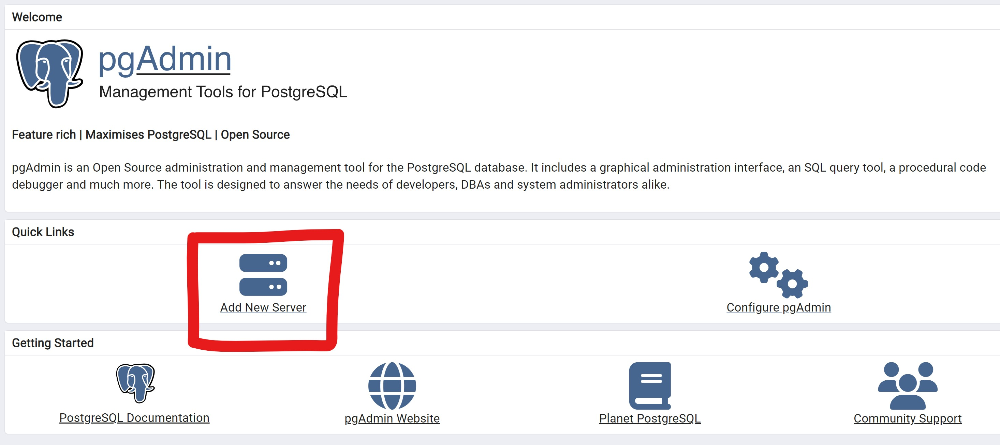
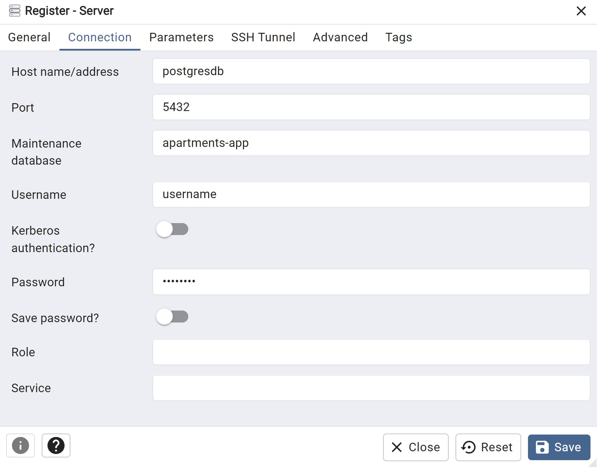

# apartments-api

## Summary

Backend implementation of a CRUD application that resembles an oversimplified Apartments.com.

This project exposes API endpoints which allow clients to create, view, edit, and delete users, 
apartments, and applications.

### Users of the application can:
- Create and manage their user profile
- List apartments that they own
- View apartments posted by other users
- Apply to apartments that interest them
- Browse and accept applications 

## How to use this project

This is a locally hosted project. In order to use it, you must create a local copy and run the application.
However, this process takes only a few simple steps thanks to Docker Compose.

### Requirements
- Docker Desktop (for Mac and Windows)

### Steps
1. Either clone or fork this repo to obtain a copy on your local machine
2. Navigate to the root repository of the project and open a command prompt/terminal
3. Run the Docker Desktop application
4. Enter the command `.\mvnw clean install` to install a JAR file in the target directory
5. Enter the command `docker compose -f compose.yaml up` to start the project
6. Once the project is running, you are able to send requests. For convenience, a Postman collection
   is provided in the file `postman_collection` in the root of the repository. Simply import this as a
   collection in Postman in order to have access to all the available requests. Additionally, complete
   documentation for all endpoints is listed below.
7. To view objects in the Postgres database, navigate to `http://localhost:80` to access
   a running instance of pgAdmin. Directions for logging in are below.

## pgAdmin Login

1. Follow the steps above to run the application
2. Navigate to `http://localhost:80`
3. You should see the login box shown in the image below. Login with the following credentials:
   - Email Address / Username: `admin@domain.com`
   - Password: `password`


4. Click on `Add New Server`



5. Under the `General` tab, add any name for the server to the `Name` field


6. Under the `Connection` tab, fill out the following fields:
   - Host name/address: `postgresdb`
   - Port: `5432`
   - Maintenance database: `apartments-app`
   - Username: `username`
   - Password: `password`



7. Click `Save`
8. On the left hand side of the page the server wil be created. Open the server and navigate to 
   `Databases > apartments-app > Schemas > Tables`. You will see three tables titled users, apartments, 
   and applications.

# Apartments API Reference

The base url for all requests is `http://localhost`

## Users

### Create User

Create a new user.

Endpoint: `POST` /users

**Body: User**
```
{
    "id": null,
    "firstName": "John",
    "lastName": "Rogers",
    "email": "john@gmail.com",
    "phoneNumber": "1234567894",
    "birthDate": "1999-04-28",
    "dateJoined": null
}
```

### Attributes
- **id**: integer or null
   - User id is assigned by the application so null is fine
- **firstName**: string
- **lastName**: string
- **email**: string
   - Must be unique
- **phoneNumber**: string
   - Must be 10 digits with no spaces or dashes ex. 1234567890
   - Must be unique
- **birthDate**: date
   - User must be between 18 and 100 years of age
- **dateJoined**: date
   - This value will be set by the application so null is fine

**Response Codes**
- `201` - created successfully
- `409` - there is a conflict between the provided attributes and existing data

**Response: User**
```
{
    "id": 1,
    "firstName": "John",
    "lastName": "Rogers",
    "email": "john@gmail.com",
    "phoneNumber": "1234567894",
    "birthDate": "1999-04-28",
    "dateJoined": null
}
```

### Get User

Retrieve a user by id

Endpoint: `GET` /users/:id

Example: `/users/1`

**Response Codes**
- `200` - retrieved successfully
- `404` - user id is invalid

**Response: User**
```
{
    "id": 1,
    "firstName": "John",
    "lastName": "Rogers",
    "email": "john@gmail.com",
    "phoneNumber": "1234567894",
    "birthDate": "1999-04-28",
    "dateJoined": null
}
```

### Get All Users

Retrieve a list of all users

Endpoint: `GET` /users

**Response Codes**
- `200` - retrieved successfully

**Response: List**
```
[
    {
        "id": 1,
        "firstName": "John",
        "lastName": "Rogers",
        "email": "john@gmail.com",
        "phoneNumber": "1234567894",
        "birthDate": "1999-04-28",
        "dateJoined": "2025-01-10"
    },
    {
        "id": 2,
        "firstName": "Bob",
        "lastName": "Smith",
        "email": "bob@gmail.com",
        "phoneNumber": "1234565894",
        "birthDate": "1993-04-28",
        "dateJoined": "2025-01-10"
    }
]
```

### Update User

Update a user

Endpoint: `PUT` /users

**Body: User**
```
{
    "id": 1,
    "firstName": "John",
    "lastName": "Rogers",
    "email": "john@gmail.com",
    "phoneNumber": "1234567894",
    "birthDate": "1999-04-28",
    "dateJoined": null
}
```

### Attributes
- **id**: integer
   - Must be the id of an existing user
- **firstName**: string
- **lastName**: string
- **email**: string
   - Must be unique
- **phoneNumber**: string
   - Must be 10 digits with no spaces or dashes ex. 1234567890
   - Must be unique
- **birthDate**: date
   - User must be between 18 and 100 years of age
- **dateJoined**: date
   - This value won't be updated so null is fine

**Response Codes**
- `204` - created successfully
- `404` - user id is invalid
- `409` - there is a conflict between the provided attributes and existing data

**Response: Void**

### Delete User

Delete a user

Endpoint: `DELETE` /users/:id

Example: `/users/1`

**Response Codes**
- `204` - deleted successfully
- `404` - user id is invalid
- `409` - user does not meet the requirements for deletion

**Response: Void**